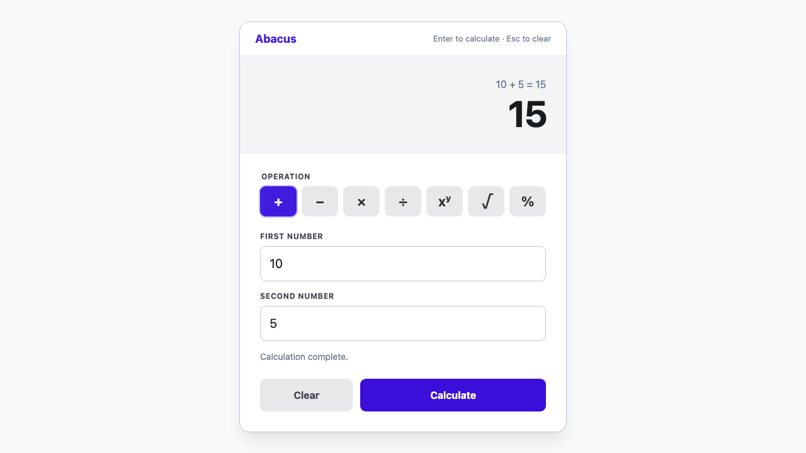
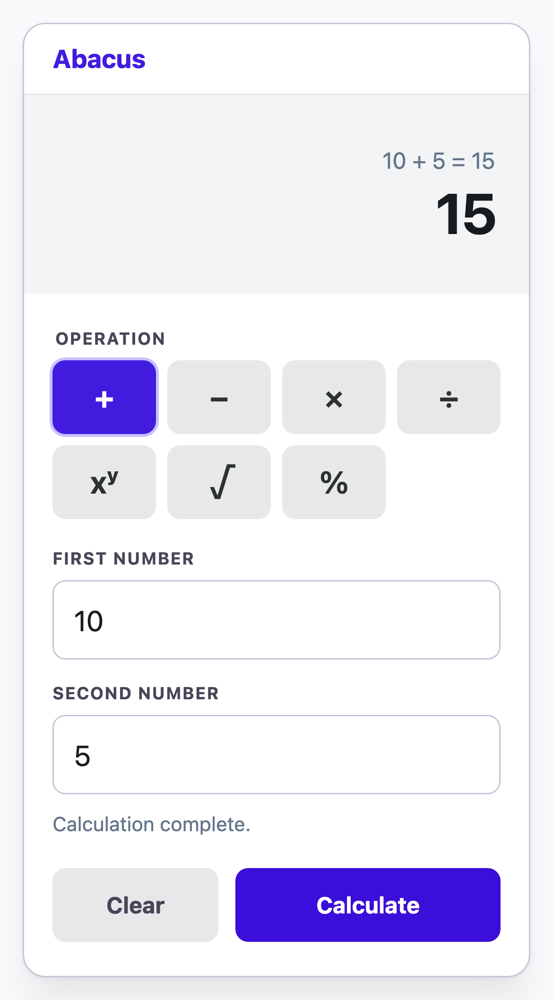

# Abacus

Abacus is a responsive, operation-based calculator built as a Sezzle software-engineering take-home exercise. A React client renders capabilities supplied by a Go API, so the available operations, labels, validation rules, shortcuts, and expression formatting stay consistent across the stack.

## Features

- Seven calculations: addition, subtraction, multiplication, division, exponentiation, square root, and percentage.
- Manifest-driven responsive UI with keyboard shortcuts, clear/reset behavior, focus continuity, and accessible live status/results.
- Immutable backend operation registry with declarative validation and operation-owned execution/formatting.
- Production-style local stack: React static bundle served by Nginx, with `/api` proxied to the Go service.
- Layered automated tests from Go domain/HTTP tests through React component tests to browser acceptance tests.

## Prerequisites

- Docker Desktop with Docker Compose (required for the full stack and canonical E2E run)
- Go 1.26+ (required for server commands)
- Node.js 22+ and npm (required for client commands and Playwright)

## Run it

The Docker path is the simplest way to run the complete application:

```sh
docker compose up --build
# Calculator: http://localhost:3000
# API health:  http://localhost:8080/health
```

Stop it with `make docker-down`.

For local development, run the services separately:

```sh
make run-server
cd client && npm install && npm run dev
```

The Vite development server proxies `/api` to `http://localhost:8080`.

## Build and verify

```sh
make build                 # build the Go API to server/bin/api
make verify                # Go format check, lint, race tests, build
cd client && npm run verify # ESLint, TypeScript/Vite build, component coverage
make e2e                   # clean Compose lifecycle + desktop/mobile Playwright + teardown
make e2e-local             # Playwright against an already-running Docker stack
```

`make e2e` is the canonical acceptance command. For local browser debugging, use `cd client && npm run test:e2e:headed`; view the last HTML report with `cd client && npm run test:e2e:report`.

## REST API

The API base path is `/api/v1`.

```sh
# Read the UI capability manifest
curl http://localhost:8080/api/v1/operations

# Execute a calculation
curl -X POST http://localhost:8080/api/v1/calculations \
  -H 'Content-Type: application/json' \
  -d '{"operationId":"percentage","operands":[200,15]}'
```

The calculation response is:

```json
{
  "expression": "15% of 200",
  "result": 30
}
```

Errors consistently use `{ "code": "...", "message": "..." }`; for example, division by zero produces `422 validation_failed`. The [API contract](docs/knowledge/api/API_CONTRACT.md) specifies the complete manifest, request, validation, and error schema.

## Design decisions

- An immutable operation registry is the backend source of truth; it generates the frontend manifest in deterministic order.
- Declarative validation is projected to the client for immediate feedback and enforced again by the API.
- Operations own execution and specialized expression formatting (for example, `15% of 200`).
- The frontend is manifest-driven rather than hardcoded to a fixed calculator layout.
- The Go runtime handles graceful shutdown; Docker Compose provides the repeatable full-stack environment.
- Tests follow a small testing pyramid: Go unit/HTTP tests → React component tests → Playwright acceptance tests through Nginx and the real API.

## Testing evidence

The [test strategy](docs/knowledge/testing/TEST_STRATEGY.md) and [verified acceptance results](docs/knowledge/testing/ACCEPTANCE_TEST_RESULTS.md) describe the live-stack suite and retained evidence.





## Repository structure

```text
client/  React + TypeScript frontend and Playwright suite
server/  Go + Chi API and calculator domain
docs/    Engineering records, API contract, architecture, and test evidence
```

## Engineering and AI usage

The engineering workflow, decisions, and accepted trade-offs are recorded in the [engineering process](docs/engineering/ENGINEERING_PROCESS.md), [engineering log](docs/engineering/ENGINEERING_LOG.md), [roadmap](docs/engineering/ROADMAP.md), and [technical-debt register](docs/engineering/TECHNICAL_DEBT.md). AI-assisted work was reviewed against project conventions and verified with repository commands; the concise [AI prompt inventory](docs/knowledge/AI_PROMPTS_USED.md) records the tools, roles, and prompt categories without reproducing conversations.
