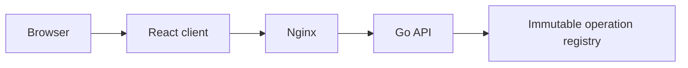
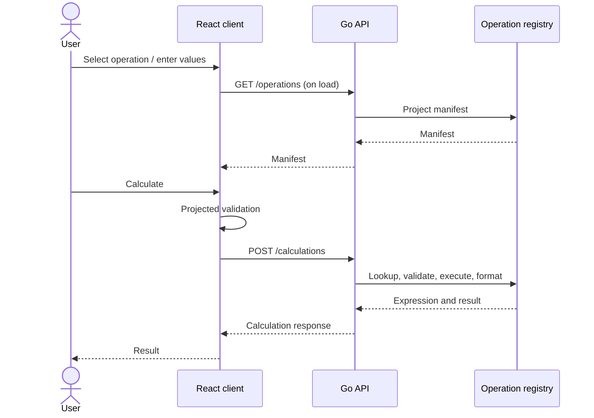

# Architecture Knowledge

Abacus keeps the calculator catalogue and rules in the Go domain. The API projects that source of truth as a manifest; the React client renders it without embedding a duplicate list of operations or validation rules. Consequential trade-offs are recorded in the [engineering ADRs](../../engineering/adr/README.md).

## Component view

## Calculation sequence

